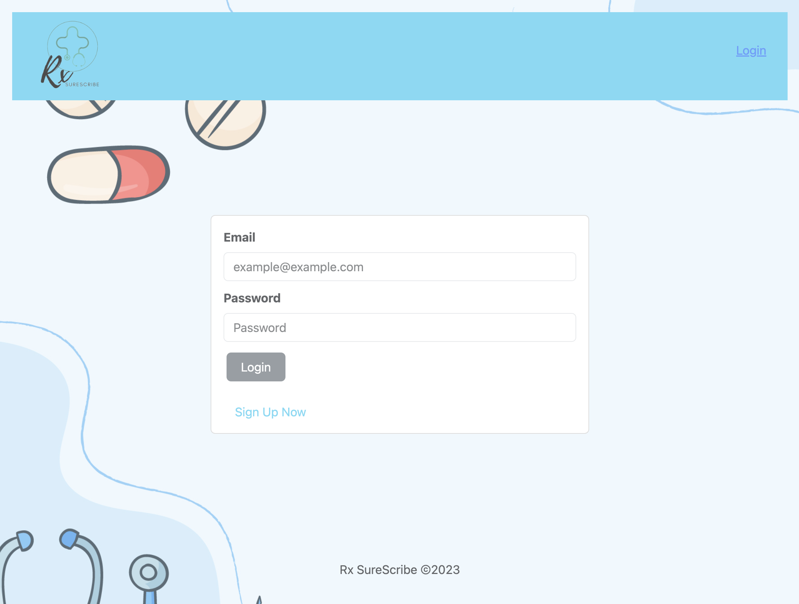

# Rx SureScribe

Rx SureScribe is a web application that aims to bridge the communication between physicians and pharmacists for all their pharmaceutical needs.

## Technologies Used

- Frontend:

  - React: The frontend is built using React, a popular JavaScript library for building user interfaces.
  - Vite: Vite is used as the build tool and development server for the frontend.
  - Apollo Client: Apollo Client is used for handling GraphQL queries and mutations on the frontend.
  - Bootstrap: Bootstrap is used for styling the frontend components.
  - Bootstrap Icons: Bootstrap Icons are used for adding icons to the frontend.

- Backend:
  - Apollo Server: Apollo Server is used as the GraphQL server for the backend.
  - Mongoose: Mongoose is used as the MongoDB object modeling tool for the backend.

## Project Structure

The codebase is organized into two main directories: "client" and "server".

- Client Directory:

  - Contains the frontend code.
  - The "src" directory contains the main source code for the frontend.
  - The "public" directory contains static assets like images and SVG files.
  - The "components" directory contains reusable React components used in the application.
  - The "utils" directory contains utility functions for authentication and handling GraphQL queries and mutations.

- Server Directory:
  - Contains the backend code.
  - The "config" directory contains the configuration files for the backend.
  - The "models" directory contains the Mongoose models for the database.
  - The "schemas" directory contains the GraphQL schema definitions, resolvers, and type definitions.
  - The "utils" directory contains utility functions for authentication.

## Setup

To run this project locally, follow these steps:

1. Clone the repository
2. Install dependencies with `npm install`
3. Start the development server with `npm run dev`

## Contributors

The following individuals have contributed to this project:

- [Jacob Garcia](https://github.com/DevJake99)
- [Pa Vang](https://github.com/pvang1987)
- [James Peltier](https://github.com/trackstarr)

Contributions are welcome. Please open an issue or submit a pull request.

## Resources

- Google.com
- Youtube.com
- Freepik.com (background image)
- Canva.com (icon and logo creation)
- Course materials
- Tutoring sessions

## License

This project is licensed under the terms of the MIT license.
